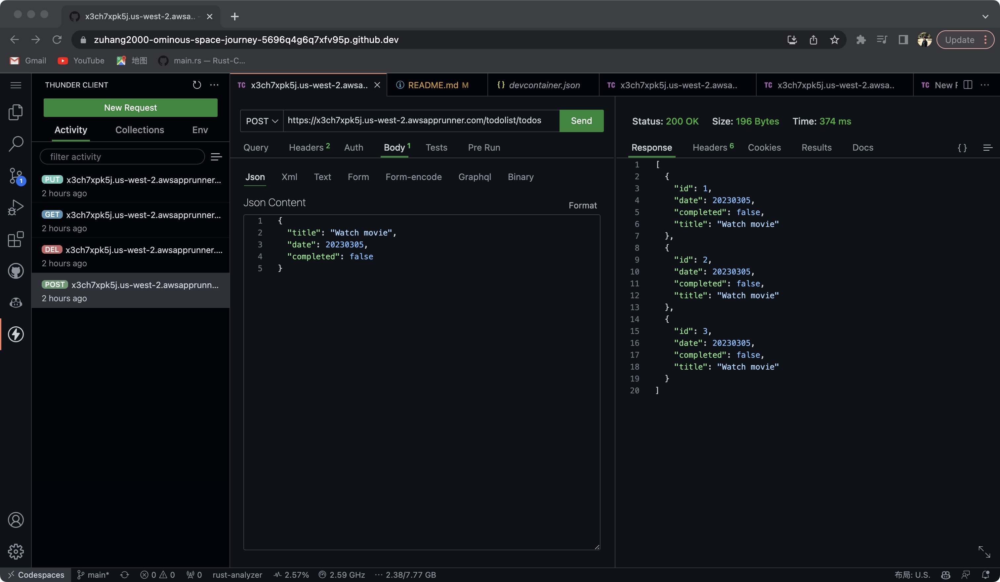
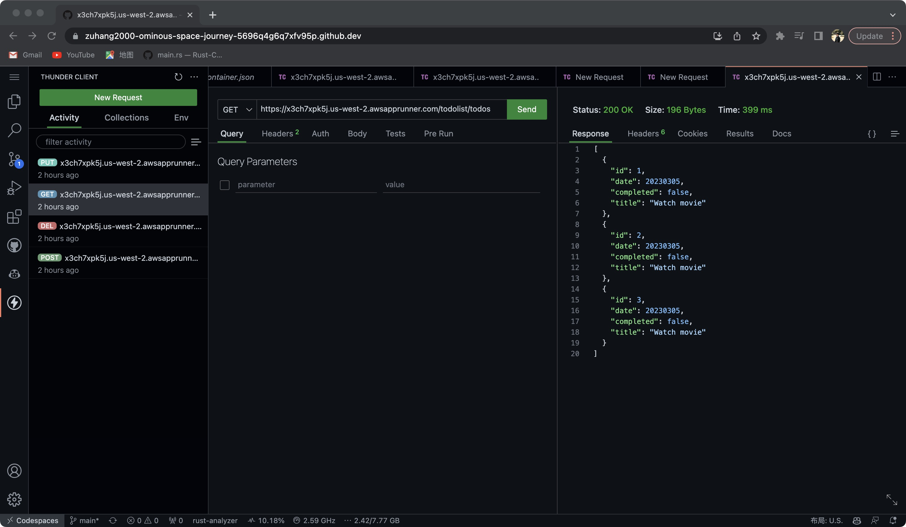
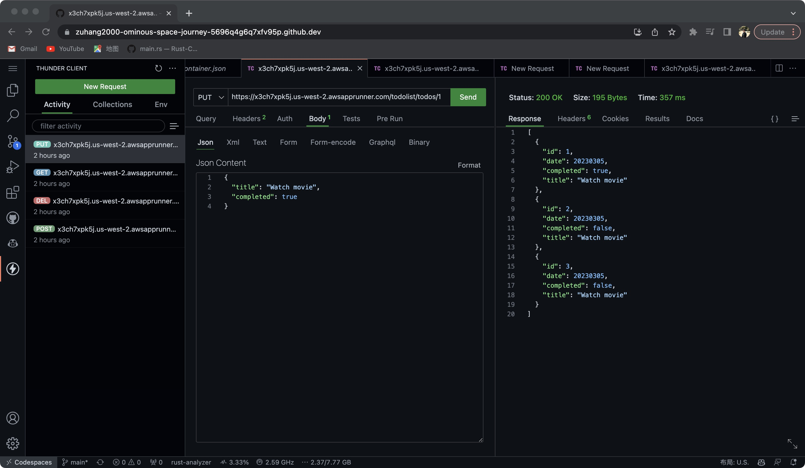
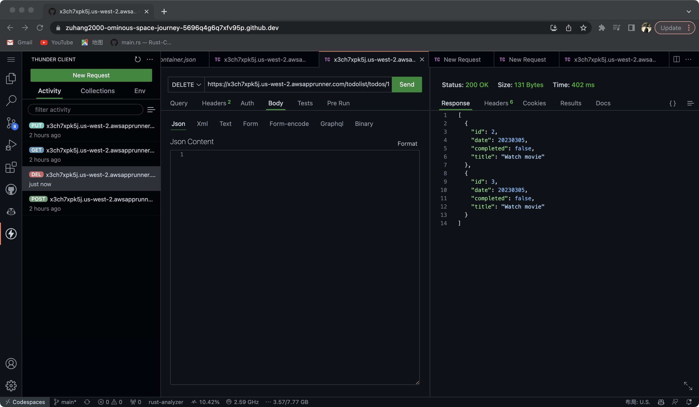
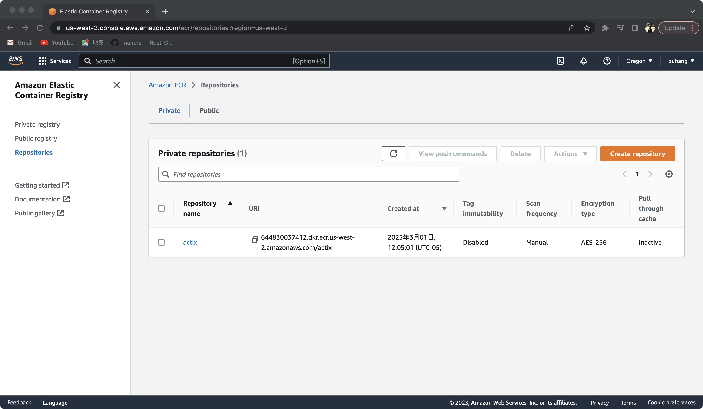
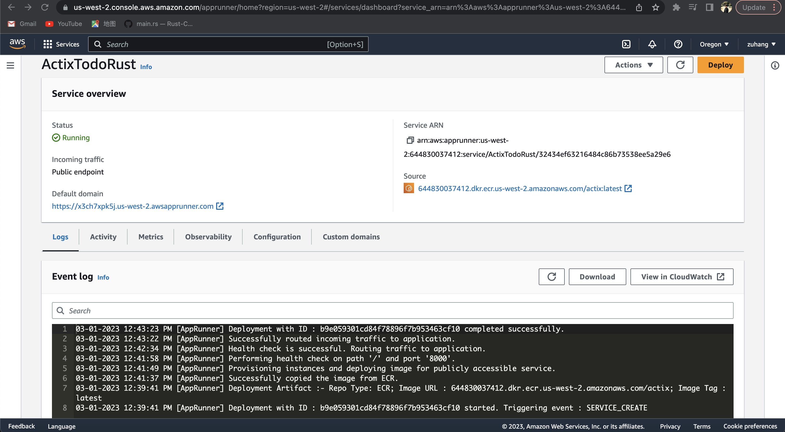
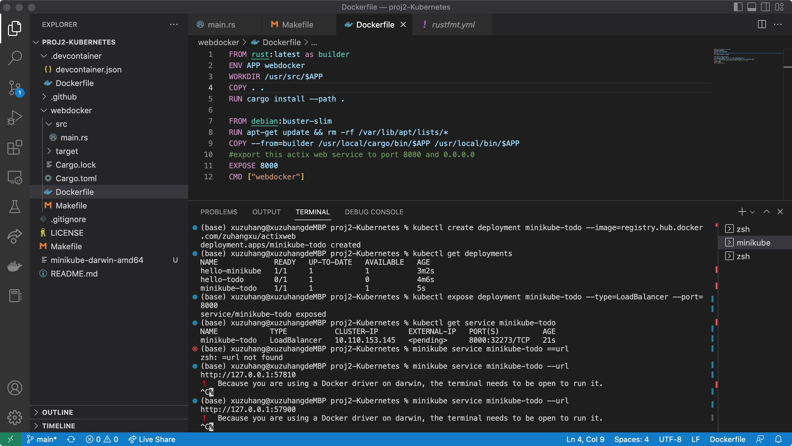
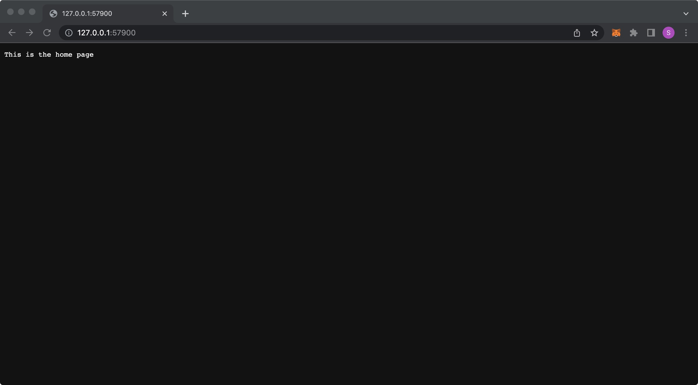

# Rust Project 2 (Kubernetes based Continuous Delivery)
Project Description: 
* This project is a rust To Do List project. 
* I Create a customized Docker container that deploys my rust project. 
* I also push the image to Cloud based Container Registery (ECR): Amazon ECR and docker hub
* First Deployment is done to be on Amazon App Runner. The URL is here: https://x3ch7xpk5j.us-west-2.awsapprunner.com/todolist/todos
* I also deploy it with mini-kubernetes. It is a local lightweight Kubernetes.

# Features
* (You need to use something like "Thunder Client" that can send http request with custome json body.)
* Create your own Todo task through "POST https://x3ch7xpk5j.us-west-2.awsapprunner.com/todolist/todos". And the request body should be a json similar to following: {"title": "Watch movie","date": 20230305,"completed": false}

* Retrieve all Todo tasks through "GET https://x3ch7xpk5j.us-west-2.awsapprunner.com/todolist/todos"

* Update your an existing Todo task through "PUT https://x3ch7xpk5j.us-west-2.awsapprunner.com/todolist/todos/1". Here "1" should be the id of an existing task. 

* Delete your an existing Todo task through "DELETE https://x3ch7xpk5j.us-west-2.awsapprunner.com/todolist/todos/1". Here "1" should be the id of an existing task.

# Docker 

* The docker image is already pushed to Amazon ECR and docker hub.
* You can replicate my docker image through:
* docker pull 644830037412.dkr.ecr.us-west-2.amazonaws.com/actix:latest
* You can also pull the docker image from Dockerhub: docker pull zuhangxu/actixweb
* After docker pull, you can run it through: docker run -it --rm -p 8000:8000 dockerimage

# Deploy
* My First Deployment is done to be on Amazon App Runner. The URL is here: https://x3ch7xpk5j.us-west-2.awsapprunner.com/todolist/todos

* Mini-Kubernetes:
* Here is how I deploy it on Mini-Kubernetes.

* So you can successfully get the URL through: "minikube service minikube-todo --url". 

## References

* [rust-cli-template](https://github.com/kbknapp/rust-cli-template)
